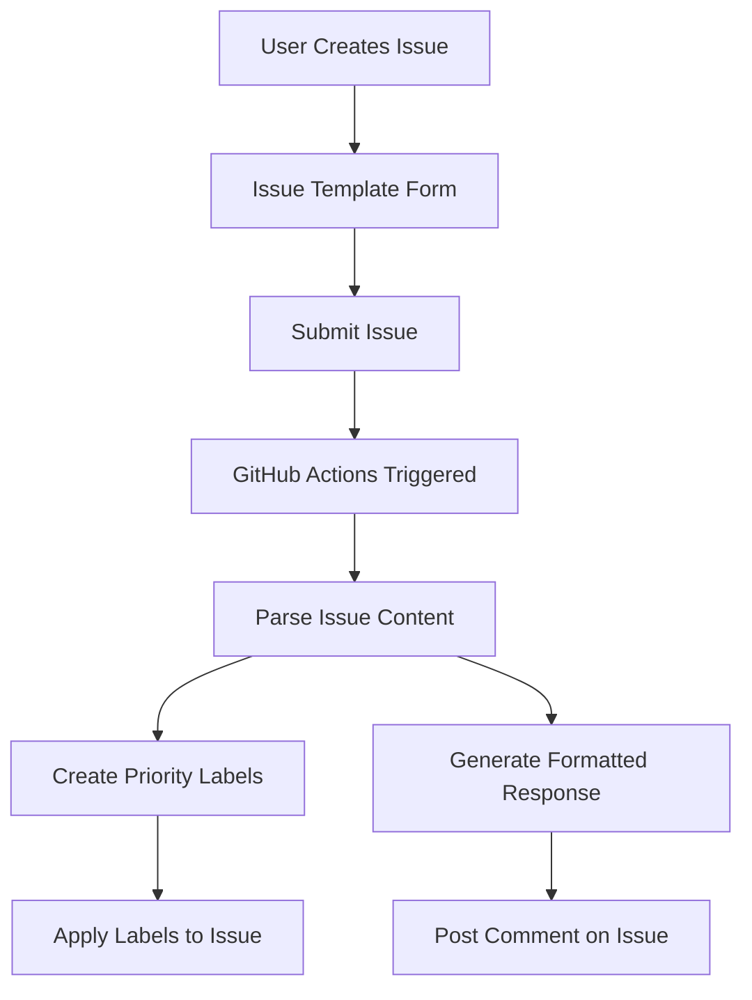

# Issue Ops Example


A demonstration of GitHub's Issue Operations (Issue Ops) capabilities, automating issue handling with structured templates and GitHub Actions.

## 📑 Overview

This repository showcases how to implement "Issue Ops" - using GitHub Issues as structured inputs that trigger automated workflows. The system captures user information through a customized issue template and processes it automatically via GitHub Actions.

Key features:

- 📋 Structured data collection through custom issue templates
- 🔄 Automated issue processing with GitHub Actions
- 🏷️ Dynamic label creation based on priority
- 📊 Formatted response comments
- ⏱️ Priority-based response time expectations

## 🚀 How It Works

The system consists of two main components:

1. **Issue Template**: Collects structured user information
2. **GitHub Actions Workflow**: Processes the submitted information



## 💻 How to Use

### Creating a New Request

1. Go to the [Issues tab](https://github.com/Kasdal/issue-ops-example/issues) of this repository
2. Click **New Issue**
3. Select the **"Enhanced User Information"** template
4. Fill out the form with the requested details:
   - Full Name
   - Position (select from dropdown)
   - Department (select from dropdown)
   - Email Address
   - Request Priority (Low/Medium/High)
   - Any additional information (optional)
5. Submit the issue

### What Happens Next

Once you submit the issue:

1. GitHub Actions workflow is automatically triggered
2. The system parses all fields from your submission
3. A priority label is created and applied to your issue based on your selected priority
4. A formatted comment is posted to your issue containing:
   - All information you provided
   - Expected response time based on priority level
   - Contact information for urgent matters

### Example Submission

Here's what a completed response looks like:

```
## 🎉 Information Received

Thank you for your submission! We've processed the following information:

| Field | Value |
| ----- | ----- |
| 👤 Name | John Smith |
| 💼 Position | DevOps Engineer |
| 🏢 Department | Engineering |
| 📧 Email | john@example.com |
| 🔔 Priority | High |
| 📝 Additional Info | Need this processed by Friday. |

Your request has been prioritized as **High** and has been tagged accordingly.

Expected response time: 24 hours

For urgent matters, please contact support@example.com
```

## 🔧 Technical Implementation

### Issue Template Structure

The issue template is defined in YAML format at `.github/ISSUE_TEMPLATE/user_info.yml`. It uses GitHub's form schema to create structured input fields including:

- Text inputs
- Dropdowns 
- Text areas
- Markdown sections

### Workflow Implementation

The GitHub Actions workflow is defined in `.github/workflows/parse-issue.yml` and includes:

1. **Event Trigger**: Activates on new issue creation
2. **Label Filter**: Only processes issues with the "user-info" label
3. **Content Parsing**: Extracts fields from the issue body
4. **Label Management**: Creates priority labels with appropriate colors
5. **Comment Generation**: Creates a formatted response with extracted data

Key technical features:

```yaml
# Parsing example for extracting issue fields
NAME=$(grep -A 2 "### Full Name" issue_body.txt | tail -n 1 | xargs)
```

```javascript
// Label creation with appropriate colors
if (priority.includes('High')) {
  labelToAdd = 'priority-high';
  color = 'D93F0B'; // red
}
```

## 🧩 Extending the System

You can extend this Issue Ops example by:

1. **Adding more fields** to the issue template
2. **Enhancing the automation** with additional logic such as:
   - Automatic assignment based on department
   - Integration with project boards
   - Email notifications
3. **Integrating with external systems** via API calls:
   - Ticket systems (Jira, ServiceNow)
   - Chat platforms (Slack, Teams)
   - CRM systems
4. **Adding validation and approval workflows**:
   - Requiring manager approval for certain priorities
   - Sequential processing steps

## 📚 Resources

- [GitHub Issue Forms Documentation](https://docs.github.com/en/communities/using-templates-to-encourage-useful-issues-and-pull-requests/syntax-for-githubs-form-schema)
- [GitHub Actions Documentation](https://docs.github.com/en/actions)
- [GitHub REST API Reference](https://docs.github.com/en/rest)

## 📝 License

This project is licensed under the MIT License - see the LICENSE file for details.

---

Created with ❤️ by [Kasdal](https://github.com/Kasdal) and MCP 🚀
